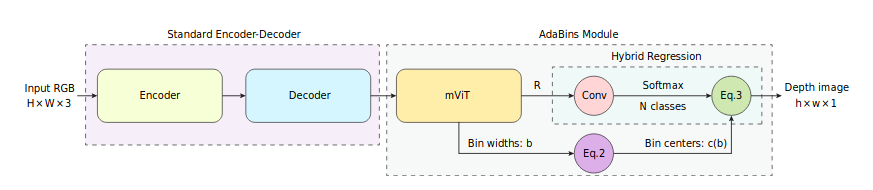
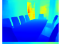
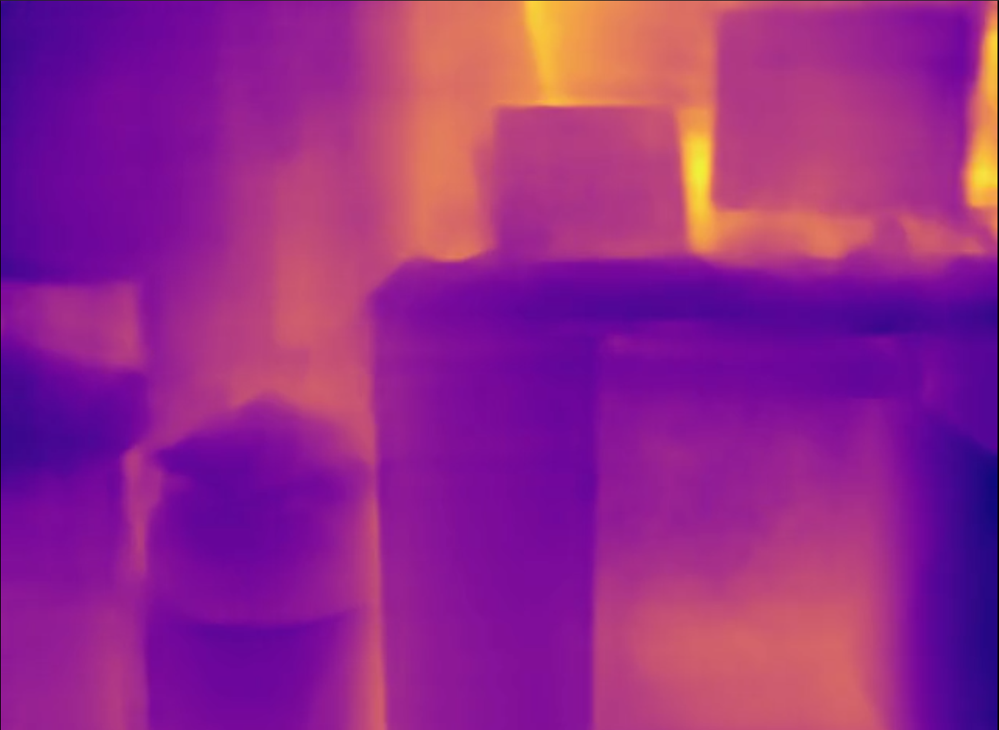

# AdaBins: A PyTorch Implementation

## Introduction
An easy to use implementation of the [Adabins](https://arxiv.org/abs/2011.14141) by Bhat et al.
This effort was undertaken under [SRM-MIC](https://github.com/srm-mic)'s 'ResCon' event.

## The prompt
The problem addressed over here is the estimation of the Depth map of an environment from a single RGB image so as to aid automative vehicles/robots and hopefully replace stereo cameras and LIDAR which are being used right now. 

 

## The Approach
This prompt has been one of the classic Computer Vision task with a vast number of architectures trying to tackle this. The architectures however have a drawback which being that the global analysis of the output values takes place when the tensors reach a very small spatial resolution or are at the bottleneck layer. To deal with this very problem the Authors propose a new architecture building block known as <b><i>AdaBins</i></b>. 

The <b><i>AdaBins</i></b> module performs a global statistical analysis of the output from a tradi-tional encoder-decoder architecture and tries to refine the output Depth map. 

## The Dataset
For our implementation we decided to go for the [NYU Depth Dataset v2](https://cs.nyu.edu/~silberman/datasets/nyu_depth_v2.html). The dataset consists of over 1400 Densely Labeled indoor images with RGB and depth images pairs. 
 

## The Results
Paper Results 
 
Our Results 
 

You can access the demo notebook [here](https://nbviewer.jupyter.org/github/aryankargwal/AdaBins_PyTorch/blob/main/Adabins_Inference_example.ipynb) if the [GitHub](https://github.com/aryankargwal/AdaBins_PyTorch/blob/main/Adabins_Inference_example.ipynb) does not open.
